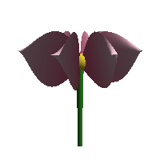
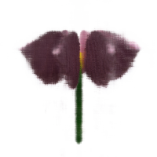
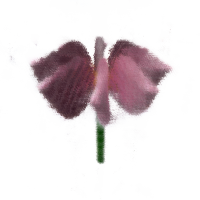
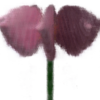

# nerf-triton

NeRF (Neural Radiance Fields) rendering demo with Triton. Features a
complete pipeline from synthetic data generation through NeRF training
to interactive 3D viewing and offline neural rendering.

## Sample Renders

Four 200×200 outputs from the pipeline — left to right: conventional rasterisation
(same triangle / z-buffer / Lambertian algorithm as the interactive OpenGL viewer),
then three NeRF novel views at different angles and focal lengths.

| OpenGL pipeline | NeRF — front | NeRF — side / elevated | NeRF — back / telephoto |
|:-:|:-:|:-:|:-:|
|  |  |  |  |

Screenshots are generated by `python -m scripts.capture_screenshots` (see `scripts/capture_screenshots.py`).

## Architecture

```
data/               Synthetic flower scene generation & software rasterizer
nerf/               NeRF core: model, encoding, rays, sampling, volume rendering
viewer/             Interactive PyOpenGL viewer with FPS camera controls
playback/           Offline NeRF rendering of recorded camera paths
tests/              90 integration tests covering every subsystem
```

## Quick Start

```bash
pip install -r requirements.txt

# Generate training data (synthetic flower, 100 views)
python -m data.render_views

# Train the NeRF
python -m nerf.train --data_dir data/ --output_dir checkpoints/

# Launch interactive viewer (requires display)
python -m viewer.app

# Or run headless to generate a camera path
python -m viewer.app --headless --num_frames 60 --output camera_path.json

# Render the recorded path through the trained NeRF
python -m playback.render_path --checkpoint checkpoints/model.pt --path camera_path.json
```

## Interactive Viewer Controls

| Key       | Action                 |
|-----------|------------------------|
| W/A/S/D   | Move forward/left/back/right |
| Mouse     | Look around            |
| +/-       | Zoom in/out            |
| R         | Toggle recording       |
| ESC       | Quit                   |

When recording is stopped, the camera path is saved to `camera_path.json`.

## Testing

```bash
# Run all 90 tests (no GPU or display required)
python -m pytest tests/ -v
```

Tests cover: positional encoding, NeRF MLP, ray generation, volume rendering,
stratified/hierarchical sampling, flower mesh generation, camera math,
path recording, training convergence, and end-to-end rendering.

## Triton Integration (planned)

The volume rendering pipeline (`nerf/rendering.py`) is structured as a clean
PyTorch reference implementation ready for Triton kernel replacement. Key
targets for Triton acceleration:

- Volume rendering accumulation (alpha compositing along rays)
- Positional encoding (batched sin/cos)
- Ray generation (camera-to-pixel direction computation)
